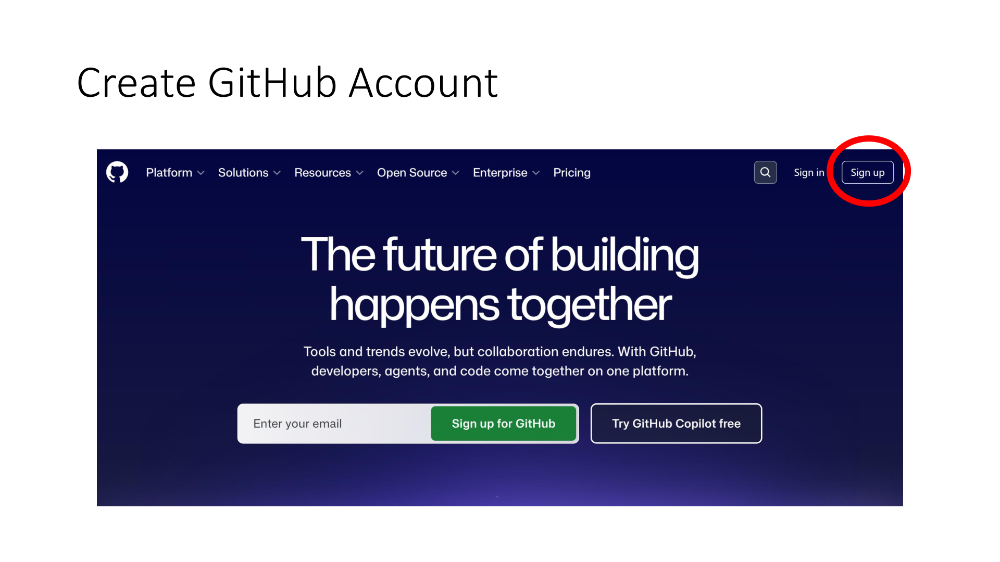
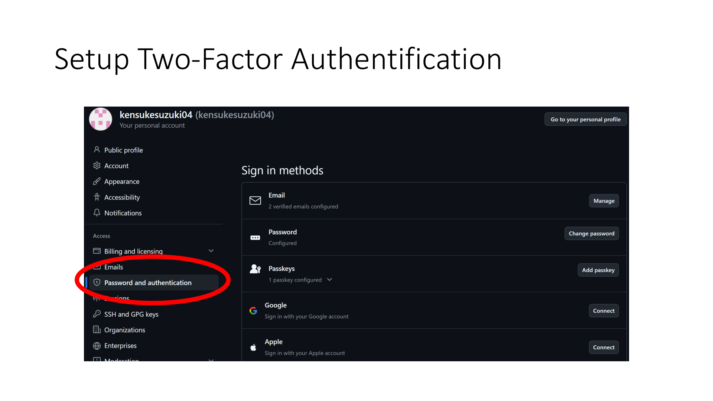
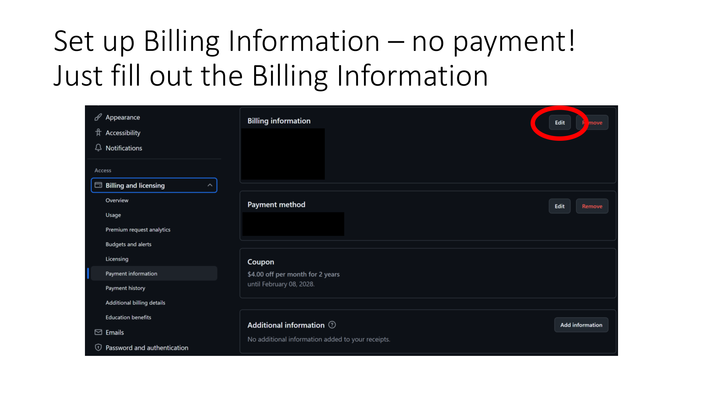
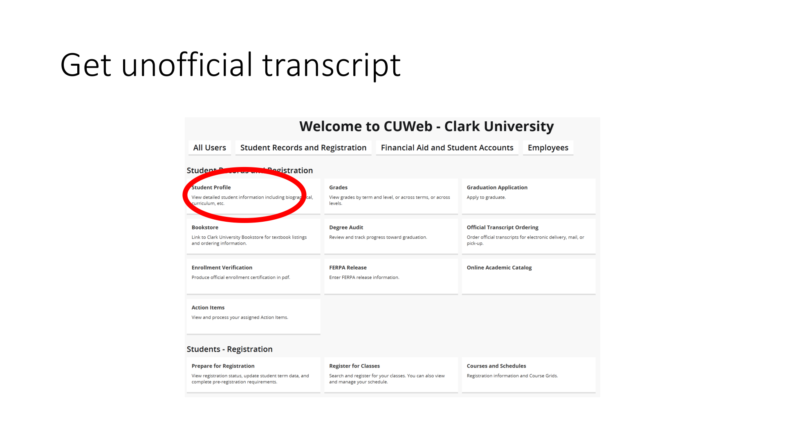
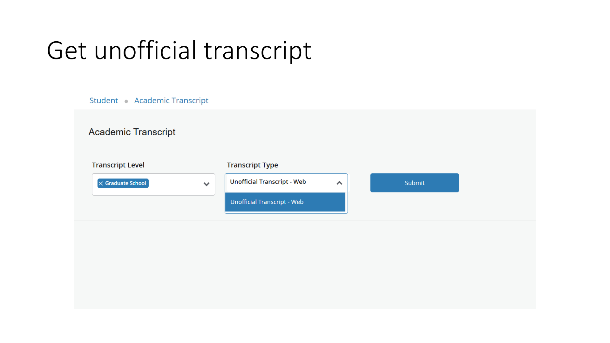
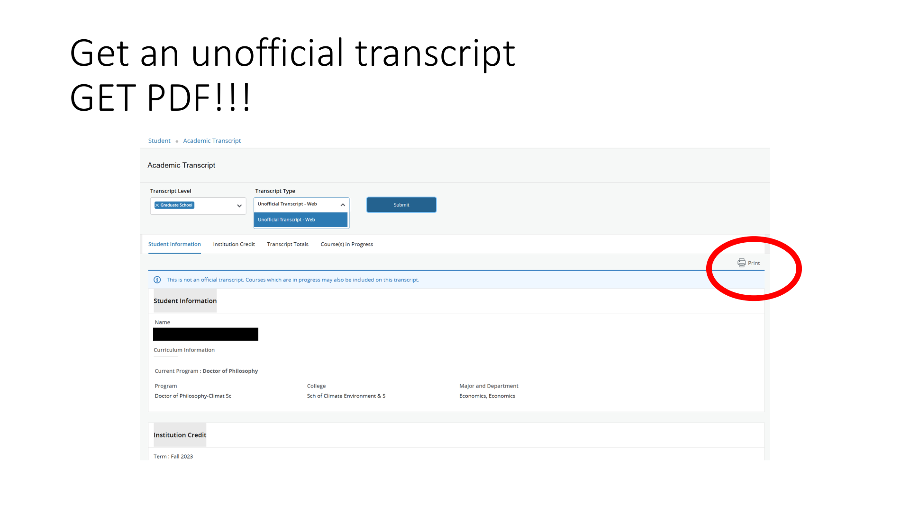
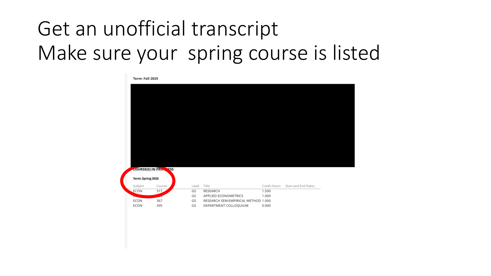
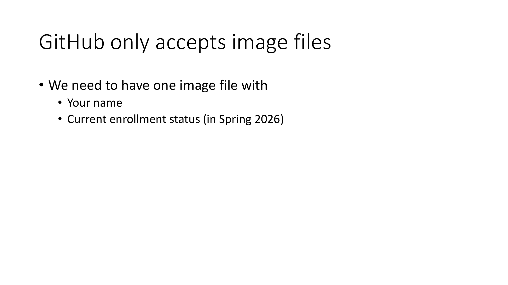
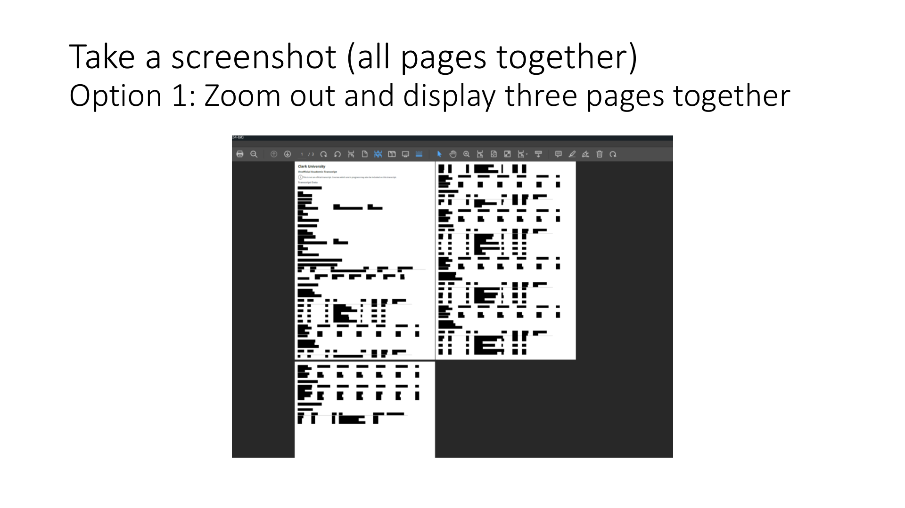
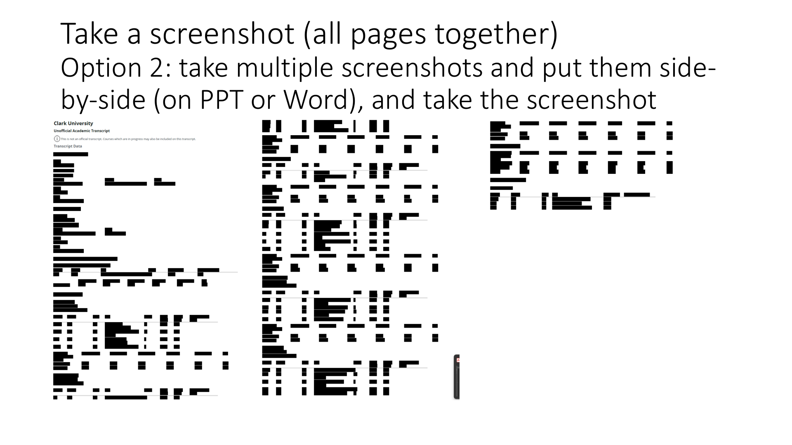

# GitHub Copilot Pro — Student Verification

> **Course Use**
> This guide is prepared for Clark University Economics Department courses `ECON206` and `ECON10`.
>
> **Prepared by**
> Prof. Kensuke Suzuki and Nick Wang

**Complete this before installing any other software.**
Student verification can take time, so start early.

---

## Overview

To get GitHub Copilot Pro for free as a student, you need to:

1. Create a GitHub account
2. Set up Two-Factor Authentication (2FA)
3. Fill in Billing Information (no payment required)
4. Upload your unofficial transcript as proof of enrollment

---

## Step 1: Create a GitHub Account

Go to https://github.com and click **Sign up** in the top-right corner.

---

## Step 2: Set Up Two-Factor Authentication

GitHub requires 2FA before you can apply for student benefits.

From your GitHub Dashboard, click your **profile icon** in the top-right corner, then click **Settings**.

In Settings, scroll down on the left sidebar and click **Password and authentication**.

Scroll down to **Two-factor authentication** and enable it. You can use the same authenticator app you already use for Clark University (e.g., Microsoft Authenticator or Google Authenticator).

---

## Step 3: Apply for the GitHub Student Developer Pack

Go to https://education.github.com/pack and apply for the Student Developer Pack.

During the application, GitHub will ask you to fill in **Billing Information**. This does **not** require a credit card or any payment. Just complete the form.

Go to **Settings → Billing and licensing → Payment information** and click **Edit** next to Billing information.

---

## Step 4: Get Your Unofficial Transcript

GitHub requires proof that you are currently enrolled. The easiest option is an **unofficial transcript** from CUWeb showing your current courses.

### 4a. Go to CUWeb

Log in to CUWeb at https://cuweb.clarku.edu. Under **Student Records and Registration**, click **Student Profile**.

### 4b. Open Academic Transcript

In your Student Profile, find and click **Unofficial Academic Transcript** in the left sidebar.

### 4c. Select Unofficial Transcript and Submit

Set **Transcript Type** to **Unofficial Transcript - Web** and click **Submit**.

### 4d. Download as PDF

When the transcript loads, click the **Print** button in the top-right corner and save it as a PDF file.

### 4e. Confirm Your Spring Course Is Listed

Before uploading, make sure your **Spring 2026** courses are visible on the transcript. GitHub needs to see that you are currently enrolled this semester.

### 4e. Convert the Transcript to an Image for Upload

**GitHub only accepts image files** (not PDFs) as proof of enrollment. Your image must show:

- Your **name**
- Your **current enrollment status** (Spring 2026 courses listed)

**Option 1:** Zoom out in your PDF viewer to display multiple pages at once, then take a screenshot.

**Option 2:** Take separate screenshots of each page, arrange them side-by-side in PowerPoint or Word, then take a screenshot of that combined view.

Upload this screenshot image when GitHub asks for proof of enrollment.

---

## Checklist

- [ ] GitHub account created
- [ ] Two-factor authentication enabled
- [ ] Billing information filled out (no payment)
- [ ] Student Developer Pack application submitted at https://education.github.com/pack
- [ ] Unofficial transcript downloaded as PDF with Spring 2026 courses listed
- [ ] Transcript uploaded to GitHub as proof of enrollment
- [ ] Student Developer Pack approved
- [ ] GitHub Copilot Pro active on your account

---

## Troubleshooting

### "My application was not approved"

- Make sure you used your `@clarku.edu` email address on your GitHub account.
- Make sure your transcript shows your **current semester** courses.
- Allow a few hours to a few days for approval.

### "GitHub is asking for payment"

- You should not need to enter payment information. Just fill in the billing address fields and leave the payment method blank or use the free student option.

### "I cannot find Unofficial Academic Transcript in CUWeb"

- Log in to CUWeb and go to **Student Records and Registration** → **Student Profile** → look in the left sidebar for **Unofficial Academic Transcript**.
