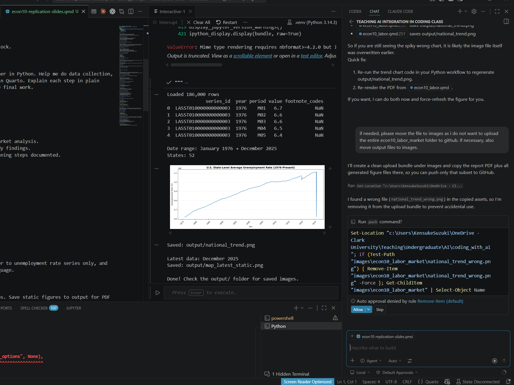
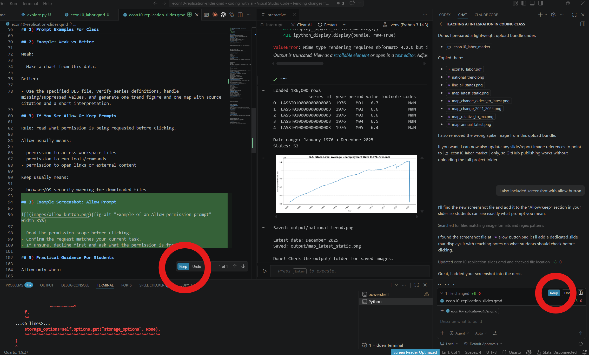
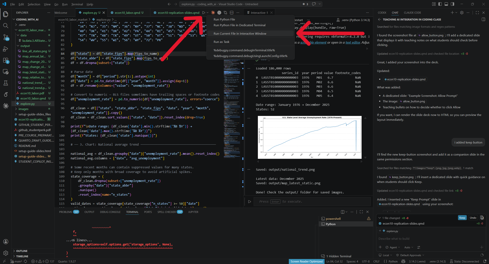

## Why This Session

- AI can now do many mechanical coding tasks quickly.
- Knowing syntax alone is less valuable than before.
- The key skill is giving logical instructions and verifying outputs.

## Today: 5 Prompt Topics

1. How to start a chat with AI
2. How to give prompts with context and important remarks
3. What to do when prompted to click Allow or Keep
4. How to check if data and tasks are credible
5. How to summarize results

## 1) How To Start The Chat

Start with clear context in one short block.

Example starter prompt:

- I am teaching ECON10 and I am a beginner in Python. Help me do data collection, cleaning, visualization, and reporting in Quarto. Explain each step in plain language so I can be accountable for the final work.

## 1) Good First Message Template

Use this template:

- Role: I am an ECON10 instructor.
- Skill level: Beginner in Python.
- Objective: Build reproducible labor market analysis.
- Output: Python script plus Quarto-ready findings.
- Constraints: Keep data source and cleaning steps documented.

## 2) How To Give Better Prompts

Use this structure every time:

1. Context
2. Exact task
3. Constraints
4. Validation checks
5. Output format

## 2) Prompt Examples For Class

Data task prompt:

- Use BLS state unemployment data, filter to unemployment rate series only, and explain each cleaning step in plain language.

Visualization prompt:

- Create both interactive and static maps. Save static figures to output for PDF with readable labels.

Debug prompt:

- Here is my error traceback. Explain the cause simply, give the minimal fix, and one check that proves it works.

## 2) Example: Weak vs Better

Weak:

- Make a chart from this data.

Better:

- Use the specified BLS file, verify series definitions, handle missing/suppressed values, and generate one trend figure and one map with source citation and a short interpretation.

## 3) If You See Allow Or Keep Prompts

Rule: read what permission is being requested before clicking.

Allow usually means:

- permission to access workspace files
- permission to run tools/commands
- permission to open links or external content

Keep usually means:

- browser/OS security warning for downloaded files

## 3) Example Screenshot: Allow Prompt

{fig-alt="Example of an Allow permission prompt" width=85%}

- Read the permission scope before clicking.
- Confirm the request matches your current task.
- If unsure, decline first and ask what the permission is for.

## 3) Example Screenshot: Keep Prompt

{fig-alt="Example of a Keep download/security prompt" width=85%}

- Keep only if the file is from a trusted source and expected.
- Verify filename, source URL, and file type before keeping.
- If unsure, cancel and re-download from the official site.

## Interactive Window: Where To Click

{fig-alt="Interactive Window screenshot showing where to click" width=90%}

- Click the run icon next to the selected code block.
- Or highlight code and press `Shift+Enter` to send it to Interactive Window.
- Use the Interactive Window pane to inspect outputs and traceback messages.

## 3) Practical Guidance For Students

Allow only when:

- you trust the source
- you understand what will be accessed
- it is necessary for the task

Do not allow when:

- the scope is unclear
- the request seems unrelated to your task
- you do not want local files scanned/read

## 4) How To Check Credibility

Before believing output, verify:

1. Data source is official and cited
2. Variable definition matches your concept
3. Time period and units are correct
4. Missing/suppressed values are handled
5. Results pass a sanity check

## 4) Credibility Example From Our Case

What went wrong:

- A suspicious spike/down appeared in recent data.

What we checked:

- series definition
- non-numeric/suppressed values
- monthly state coverage

What we changed:

- used only the target series
- excluded incomplete months

## 4) Credibility Prompt Template

Use this prompt:

- Validate this workflow. List assumptions, identify possible data quality issues, and propose checks for series definition, missing values, and coverage before interpretation.

## 5) How To Summarize

Use a short structure:

1. Main finding
2. Supporting evidence
3. Limitation/caution
4. Policy or course relevance

## 5) Summary Prompt Example

- Based on these figures, write 3 findings and 2 limitations in plain language for ECON10 students. Do not claim causality. Keep each bullet to one sentence.

## Student Exercise: Prompt Lab

1. Write one starter prompt.
2. Write one credibility-check prompt.
3. Run code and inspect outputs.
4. Write one 4-line summary using the structure above.
5. Share what changed after prompt revision.

## Final Takeaway

- AI improves coding speed.
- Prompt quality shapes output quality.
- Human responsibility remains: verify, interpret, and explain.
