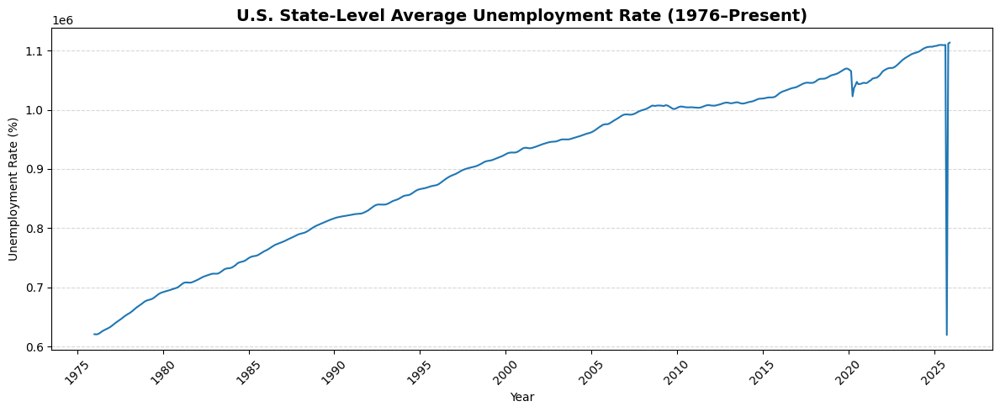

## Value of Coding in the AI Era

- AI is not most valuable as a random Q&A tool or an essay/email draft tool.
- AI is most powerful in coding, because AI itself is built with code.
- This shifts the value of "native Python coding" on a CV.

The key is:

- Your capability to control AI so it can code for your task.
- The idea must be yours (a calculator does not know what should be computed).
- You must give AI a logical order of instructions.

## Learning Objective (Today)

- write clear prompts for coding tasks,
- check whether AI output is trustworthy,
- and summarize results in plain language.

## Today: 5 Prompt Topics

- How to start a chat with AI
- How to give prompts with context and important remarks
- What to do when prompted to click "Allow" or "Keep"
- How to check if data and tasks are credible
- How to summarize results with Quarto

## How To Start The Chat

Example starter prompt:

- *I am a student of ECON10 and a beginner in Python. Help me collect, clean, visualize, and report data in Quarto. Explain each step in plain language so I can stay accountable.*

## Context Information To Include

Context to include:

- Role: ECON10 student
- Skill level: Beginner in Python
- Objective: Reproducible analysis
- Output: Python + Quarto report
- Constraints: Source citation + cleaning log

## Brainstorm Before Asking for Data Sources

- If the data source is unclear, AI can help brainstorm.
- Give your context first.

Example brainstorming prompt:

- *I want to analyze labor market conditions with Python.*
- *Suggest several feasible directions.*
- *For each option, say what data is needed and why it is useful.*
- clarifies your research question
- narrows candidate datasets
- improves AI recommendations

## Step-by-step: Data Source → Download → Save

- Ask for candidate data sources

- *Suggest 3-5 credible data sources for this task.*
- *Recommend one and show the exact URL and file name.*

- Fix the save location

- *Create folders and save raw files under data/. Save figures under output/.*

- Verify after download

- *Check that the file exists and show the first 20 lines so we can verify structure.*

- Keep a report-ready log

- *In the report, include the source URL, retrieval date, local file path, and filter rules.*

## Decide Which Visualization To Build

- Decide the visualization before asking for code.

Example prompt:

- *Suggest several effective visualization options for this dataset.*
- *For each one, explain the question, variables, and whether it should be static or interactive.*
- which chart/map to build first
- what comparison you want to emphasize
- which outputs are needed for PDF vs interactive use

## Ask AI To Write Python Visualization Code

- After planning and saving the data, ask AI for runnable code.

Example prompt:

- *Using the saved file in data/ and the selected plan, write Python code to clean the data and create the required charts/maps.*
- *Save figures in output/ and add brief comments for a beginner.*

- input file path is correct
- output file names are specified
- required packages are listed
- code includes a quick preview (`head()` / row count)

## If You Do Not Understand The Code, Ask

- Ask follow-up questions.
- Ask until you can explain each key step.
- Even when using AI for coding, you are fully responsible for what the code does and what results you report.

## How To Open Interactive Window

- Open a `.py` file and press `Shift+Enter` on a line/selection.
- Right-click in the editor and choose `Run Current File in Interactive Window`.
- Command Palette (`Ctrl+Shift+P`) → `Python: Run Current File in Interactive Window`.
- run code block by block
- inspect outputs and error tracebacks
- revise prompt and rerun

## Interactive Window Screenshot

{fig-alt="Interactive Window screenshot" width=90%}

## Start With Basic Plots First

- Start with a simple line plot or bar plot.
- Complex visuals can hide the data pattern.
- If the first chart is unclear, do not trust later charts.

## Example: Wrong Plot

{fig-alt="Example of a wrong plot with suspicious pattern" width=90%}

## Notice When Something Looks Off

- A strange spike appears in one period.
- The trend looks unrealistic.
- Stop and check data definitions, missing values, and filters before interpretation.

## Prevent Errors By Checking Data Step by Step

- Check raw file structure first.
- Check variable meaning before aggregation.
- Check missing or suppressed values.
- Check one intermediate table before each new chart.
- Looking at data step by step is how we avoid hidden mistakes.

## What Happened In The Actual Dialogue

- I asked AI why the plot looked wrong and which series should be used.
- AI answered that the series ending in 003 looked like the correct measure.
- I then asked AI to explain why, and to show official documentation before accepting that conclusion.

## When AI Says "003 Is Correct," Ask For Evidence

- *Why do you think the series ending in 003 is the correct measure?*
- *Show the official documentation and explain how you mapped code to meaning.*
- *Show why other series codes are not the target variable for this analysis.*
- Do not accept "AI says so." Ask for a credible source and reasoning chain.

## How To Give Better Prompts

- Context
- Exact task
- Constraints
- Validation checks
- Output format

## Prompt Examples For Class

Data task prompt:

- *Use the dataset I provide, clean it step by step, and explain each cleaning decision in plain language.*

Visualization prompt:

- *Create both interactive and static maps. Save static figures to output for PDF with readable labels.*

Debug prompt:

- *Here is my error traceback. Explain the cause simply, give the minimal fix, and one check that proves it works.*

## Example: Weak vs Better

Weak:

- *Make a chart from this data.*

Better:

- *Use the specified dataset, verify variable definitions, and handle missing values.*
- *Generate one trend figure and one map with source citation and a short interpretation.*

## Allow vs Keep (Quick Comparison)

- **Allow**: grants permission (for example, file access, command execution, external access).
- **Keep**: keeps/downloads a file that your browser or OS flagged.
- Check what is being requested.
- Check whether it is necessary for your current task.
- If unsure, do not click and ask for clarification first.

## Permission Safety Rule

- AI can access files/folders only after permission is granted.
- Be careful when clicking **Allow** or **Keep**.
- Do not approve unclear requests.
- Do not approve unrelated requests.
- Approve only what you understand and need.

## How To Check If Results Are Trustworthy

- Data source is official and cited
- Variable definition matches your concept
- Time period and units are correct
- Missing/suppressed values are handled
- Results pass a sanity check

## Credibility Prompt Template

Use this prompt:

- *Validate this workflow.*
- *List assumptions, data quality issues, and checks for series definition, missing values, and coverage.*

## How To Summarize

- Main finding
- Supporting evidence
- Limitation/caution
- Policy or course relevance

## Summary Prompt Example

- *Based on these figures, write 3 findings and 2 limitations in plain language.*
- *Do not claim causality.*
- *Keep each bullet to one sentence.*

## Student Exercise: Prompt Lab

- Write one starter prompt.
- Write one credibility-check prompt.
- Run code and inspect outputs.
- Write one 4-line summary using the structure above.
- Share what changed after prompt revision.

## Final Takeaway

- AI improves coding speed.
- Prompt quality shapes output quality.
- Human responsibility remains: verify, interpret, and explain.
