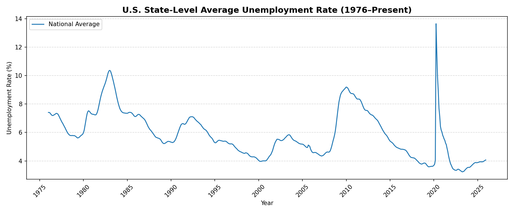
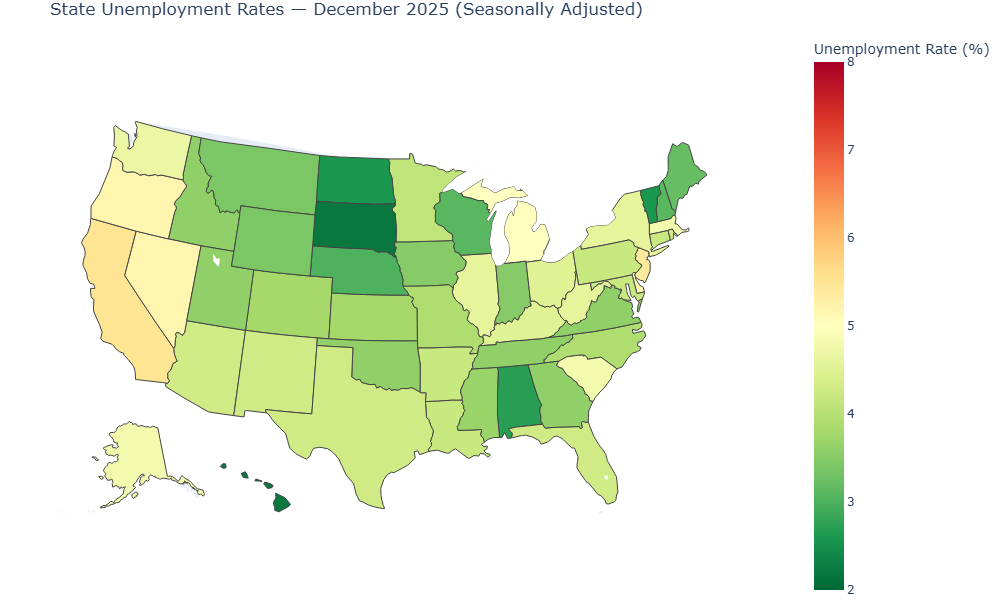

## Value of Coding in the AI Era

- AI is not most valuable as a random Q&A tool or an essay/email draft tool.
- AI is most powerful in coding, because AI itself is built with code.
- This shifts the value of "native Python coding" on a CV.

The key is:

- Your capability to control AI so it can code for your task.
- The idea must be yours (a calculator does not know what should be computed).
- You must give AI a logical order of instructions.

## Learning Objective (Today)

- write clear prompts for coding tasks,
- check whether AI output is trustworthy,
- and summarize results in plain language.

## Today: 5 Prompt Topics

- How to start a chat with AI
- How to give prompts with context and important remarks
- What to do when prompted to click "Allow" or "Keep"
- How to check if data and tasks are credible
- How to summarize results with Quarto

## How To Start The Chat

Example starter prompt:

- *I am a student of ECON10 and a beginner in Python. Help me collect, clean, visualize, and report data in Quarto. Explain each step in plain language so I can stay accountable.*

## Context Information To Include

Context to include:

- Role: ECON10 student
- Skill level: Beginner in Python
- Objective: Reproducible analysis
- Output: Python + Quarto report
- Constraints: Source citation + cleaning log

## Brainstorm Before Asking for Data Sources

- If the data source is unclear, AI can help brainstorm.
- Give your context first.

Example brainstorming prompt:

- *I want to analyze labor market conditions with Python.*
- *Suggest several feasible directions.*
- *For each option, say what data is needed and why it is useful.*

### This Helps You

- clarify your research question
- narrow candidate datasets
- get better AI recommendations

## Step-by-step: Data Source → Download → Save

Task 1: Choose the source

- *Suggest 3-5 credible data sources for this task.*
- *Recommend one and show the exact URL and file name.*

Task 2: Plan the folder structure

- *Suggest a simple folder structure for this project.*
- *Save raw data under data/ and figures under output/.*

Task 3: Verify the download

- *Check that the file exists and show the first 20 lines so we can verify structure.*

Task 4: Keep a report-ready log

- *In the report, include the source URL, retrieval date, local file path, and filter rules.*

## Decide Which Visualization To Build

- Decide the visualization before asking for code.

Example prompt:

- *Suggest several effective visualization options for this dataset.*
- *For each one, explain the question, variables, and whether it should be static or interactive.*

### This Helps You Decide

- which chart or map to build first
- what comparison to emphasize
- which outputs you need for PDF vs interactive use

## Ask AI To Write Python Visualization Code

- After planning and saving the data, ask AI for runnable code.

Example prompt:

- *Using the saved file in data/ and the selected plan, write Python code to clean the data and create the required charts/maps.*
- *Save figures in output/ and add brief comments for a beginner.*

### Check The Prompt

- the correct input file path
- the output file names
- the required packages
- a quick preview (`head()` or row count)

## If You Do Not Understand The Code, Ask

- Ask follow-up questions.
- Ask until you can explain each key step.
- Even when using AI for coding, you are fully responsible for what the code does and what results you report.

## How To Open Interactive Window

- Open a `.py` file and press `Shift+Enter` on a line/selection.
- Right-click in the editor and choose `Run Current File in Interactive Window`.
- Command Palette (`Ctrl+Shift+P`) → `Python: Run Current File in Interactive Window`.
- run code block by block
- inspect outputs and error tracebacks
- revise prompt and rerun

## Interactive Window Screenshot

{fig-alt="Interactive Window screenshot" width=90%}

## Start With Basic Plots First

- Start with the national trend.
- Start with a simple line plot or bar plot.
- Complex visuals can hide the data pattern.
- If the first chart is unclear, do not trust later charts.

## Example: Does This Plot Look Right?

{fig-alt="Example of a wrong plot with suspicious pattern" width=90%}

## Notice When Something Looks Off

- A strange spike appears in one period.
- The trend looks unrealistic.
- Stop and check data definitions, missing values, and filters before interpretation.

## Prevent Errors By Checking Data Step by Step

- Check raw file structure first.
- Check variable meaning before aggregation.
- Check missing or suppressed values.
- Check one intermediate table before each new chart.
- Looking at data step by step is how we avoid hidden mistakes.

## AI Suggested A Fix. Check It Anyway.

- I noticed that the plot looked wrong.
- I could re-check the data myself, or ask AI to help inspect it again.
- AI suggested that only series ending in 003 should be plotted, and then rewrote the figure.
- That is still not enough.
- A corrected figure is not proof.
- You should ask why AI judged this version to be correct.

## AI Rewrote The National Trend

{fig-alt="Corrected national trend figure" width=82%}

- This version looks more plausible.
- But you should not trust it only because AI redrew it.
- Ask why AI thinks this is the correct series.

## When AI Says "003 Is Correct," Ask For Evidence

- *Why do you determine the series ending in 003 is the correct measure?*
- *Show the official documentation and explain how you mapped code to meaning.*
- *Show why other series codes are not the target variable for this analysis.*
- Do not accept "AI says so." Ask for a credible source and reasoning chain.

## After The National Trend, Look At Regional Patterns

- Once the national trend looks reasonable, move to more detailed views.
- For example, compare states or regions.
- An interactive map is one useful example.

## Example: Interactive Map

- Use an interactive map to inspect patterns by state and year.
- This helps you notice regional differences that a national trend cannot show.
- Use it for exploration before deciding what to include in the final report.

## Interactive Map Workflow

- An interactive map is useful for exploration.
- But you cannot place that interactive version in a PDF report.
- So AI can also create a static map for Quarto.

## Example: Static Map For The Report

{fig-alt="Map output used for the report" width=92%}

## Ask For Concrete Revisions

- *The plot still looks wrong. Check the data being plotted again.*
- *Use only the correct series definition and rewrite the figure.*
- *Save the revised output in output/ with a clear file name.*

## Ask AI To Organize The Quarto Report

- *Create a simple Quarto report with sections for data, cleaning, figures, and findings.*
- *Include source citation, retrieval date, and file path.*
- *Show me where I should write my own observations and interpretation.*

## Let AI Build The Skeleton, Not Your Thinking

- Ask AI to suggest headings and structure.
- Ask AI where your observation, interpretation, and limitation should go.
- Write your own main finding, supporting evidence, and caution.
- Write the actual interpretation yourself.

Your brain is still required here.

## Important Cautions

- Permission safety
- Academic integrity
- Responsibility

## Permission Safety

- **Allow** grants permission, such as file access or command execution.
- **Keep** keeps or downloads a file your browser or OS flagged.
- Approve only what you understand and need.
- If you are unsure, stop and ask first.

## Academic Integrity: Think Of A Calculator

- Using a calculator is not considered cheating.
- You decide what should be calculated.
- You give the instruction.

## Academic Integrity: The Same Logic Applies To AI

- The same logic applies to AI use.
- Even a very polished analysis should get 0 if it does not answer the assignment for this course.
- AI output does not replace your academic judgment.

## Responsibility: You Must Be Able To Explain It

- You must be able to explain every step in your own words.
- That includes data collection, series choice, and what each figure shows.
- It is fine to let AI handle basic mechanical tasks.
- For example: drawing a line chart or coloring a map from low unemployment in green to high unemployment in red.
- Do not include anything complicated that you cannot explain yourself.

## Final Takeaway

- Start simple, and check the data step by step.
- Use AI for structure and mechanical coding, not for unexamined conclusions.
- Verify evidence, and explain every result in your own words.
